## 1. Main program (main.cpp)

### Flowchart – setup și loop

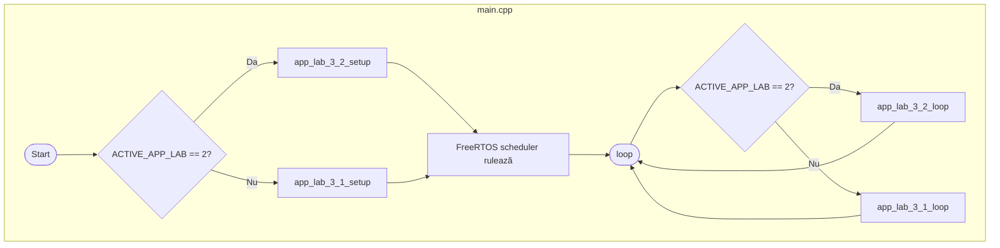

---

## 2. Lab 3.1

### 2.1 FSM – Starea sistemului (app_sys_state_t)

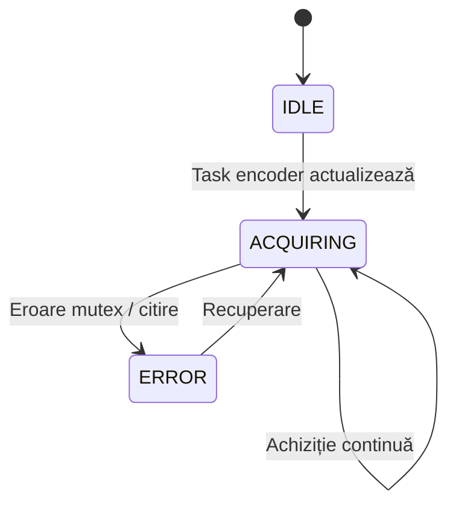

### 2.2 Flowchart – app_lab_3_1_setup

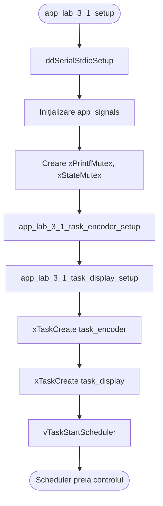

### 2.3 Flowchart – Task Encoder (Lab 3.1)

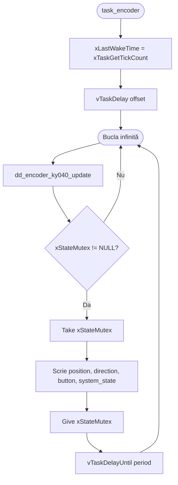

### 2.4 Flowchart – Task Display (Lab 3.1)

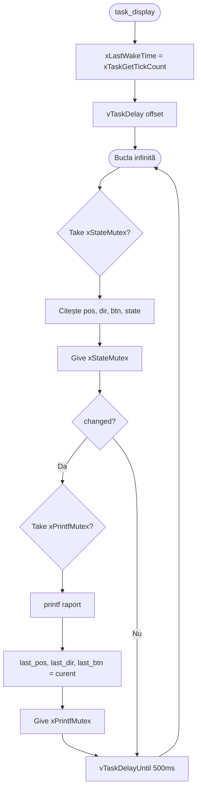

### 2.5 Flowchart – app_lab_3_1_loop

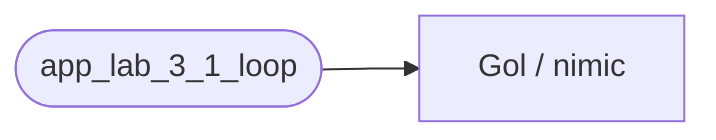

---

## 3. Lab 3.2

### 3.1 Flowchart – app_lab_3_2_setup

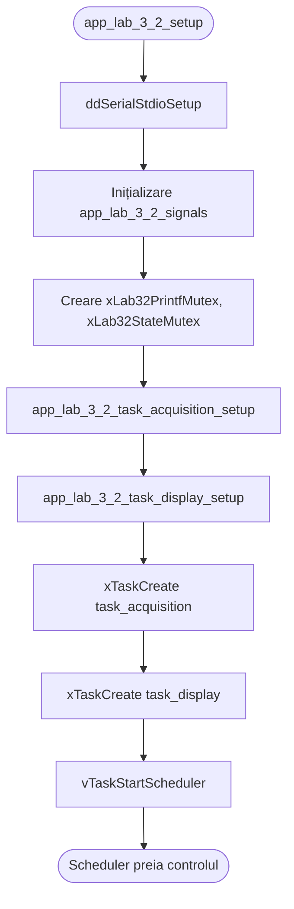

### 3.2 Flowchart – Task Acquisition + Condiționare (Lab 3.2)

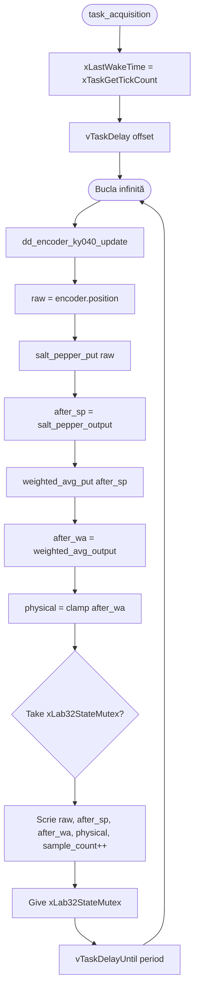

### 3.3 Flowchart – Task Display (Lab 3.2)

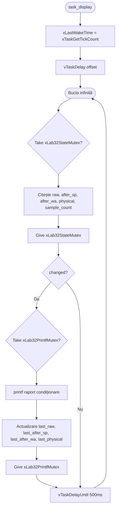

### 3.4 Flowchart – Pipeline condiționare (Lab 3.2, detaliu)

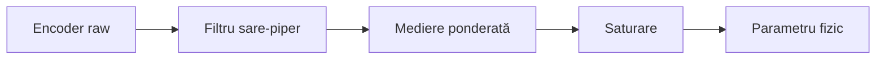

---

## 4. Overview – Lab 3.1 vs Lab 3.2

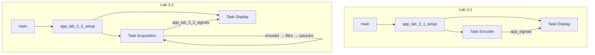

---

## 5. Secvență temporală – Lab 3.1

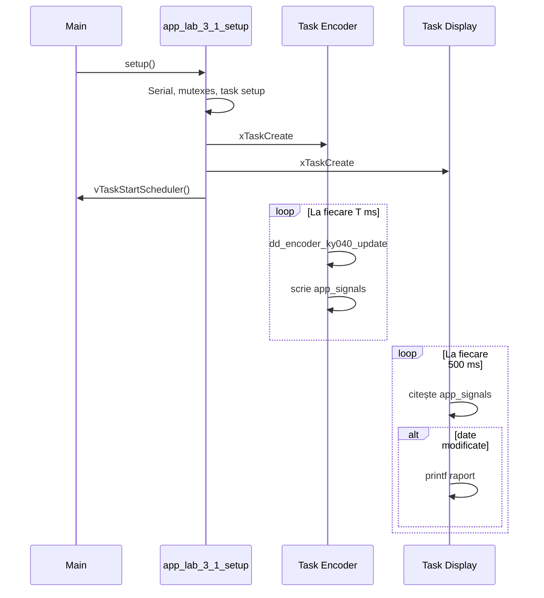

---

## 6. Secvență temporală – Lab 3.2

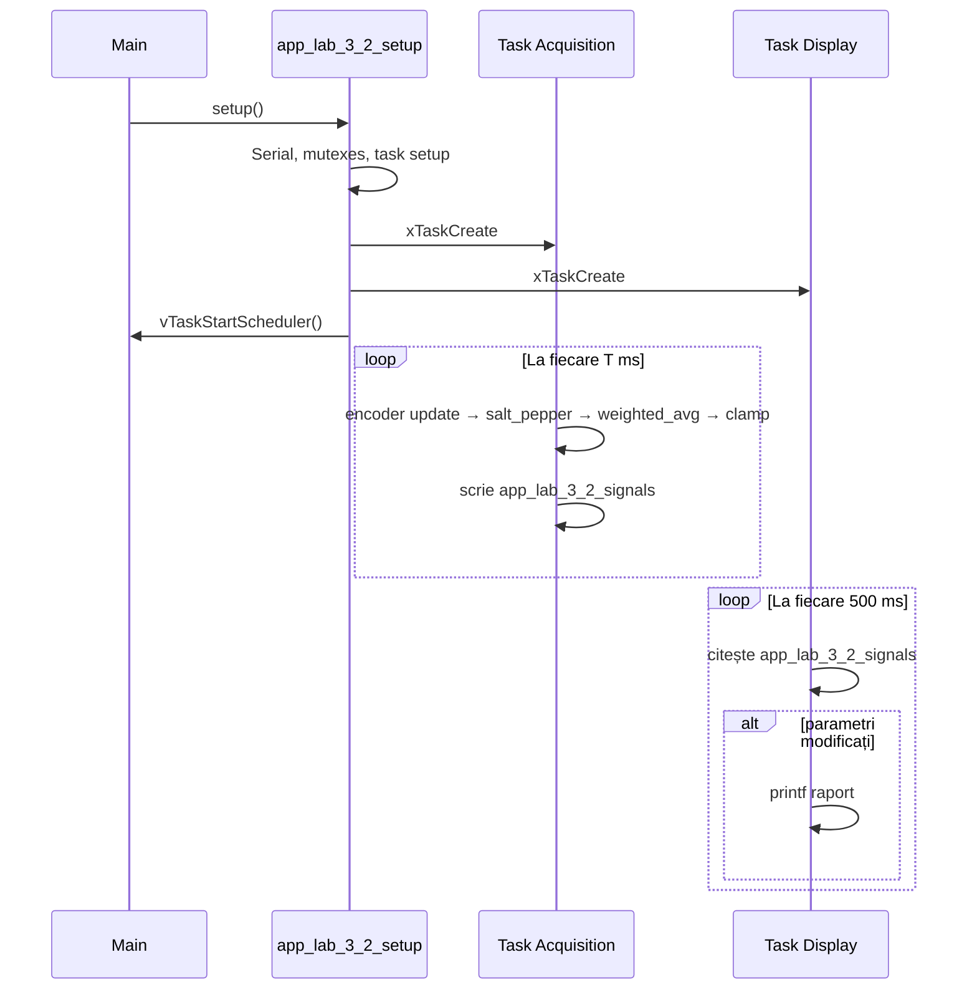
